# Bloobs Adventure Idle Save Editor [aka BAI Save Editor]

Portable Windows save editor for **Bloobs Adventure Idle**. It is built to be powerful for advanced users, while staying approachable for beginners: load a save, edit values, preview changes, keep backups, and write the save safely.

## Screenshots

<table>
  <tr>
    <td align="center">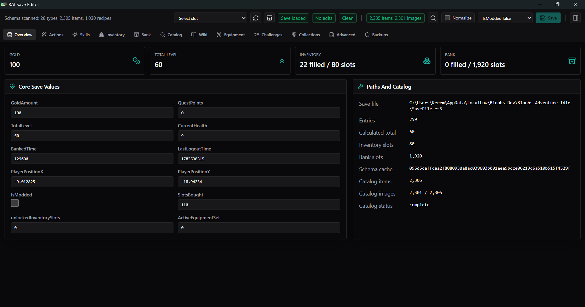 Overview</td>
    <td align="center">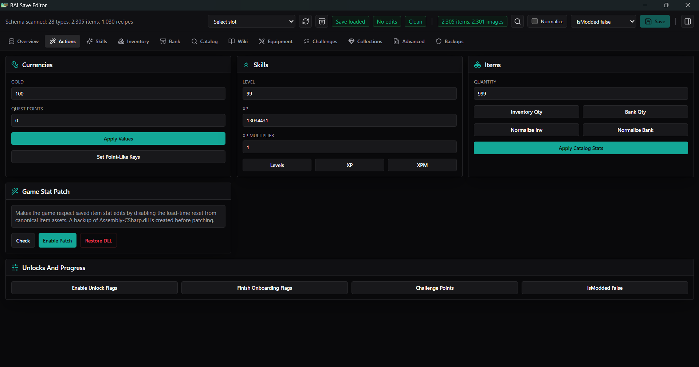 Actions</td>
    <td align="center">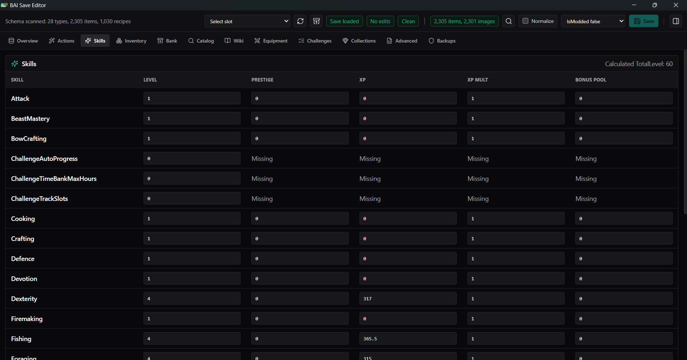 Skills</td>
  </tr>
  <tr>
    <td align="center">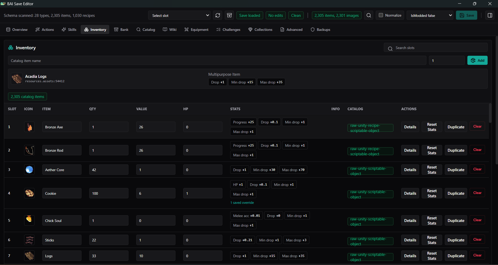 Inventory</td>
    <td align="center">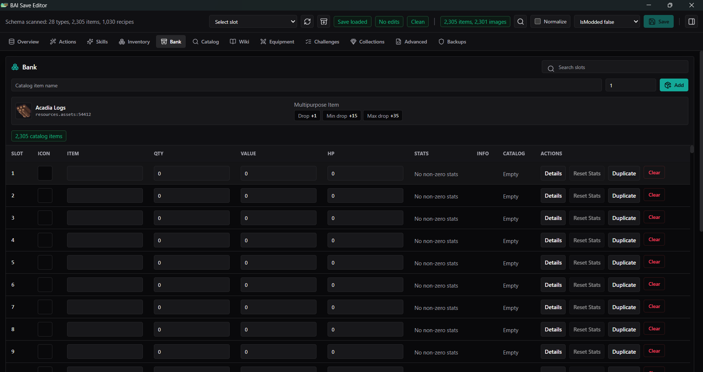 Bank</td>
    <td align="center">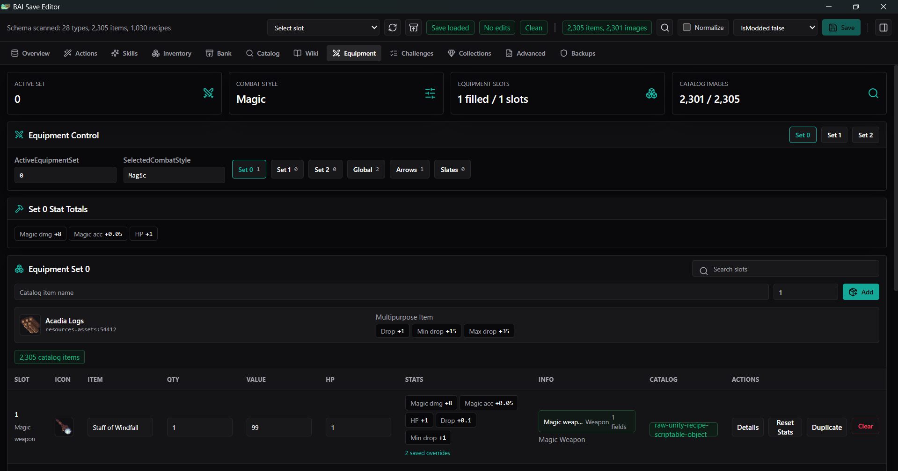 Equipment</td>
  </tr>
  <tr>
    <td align="center">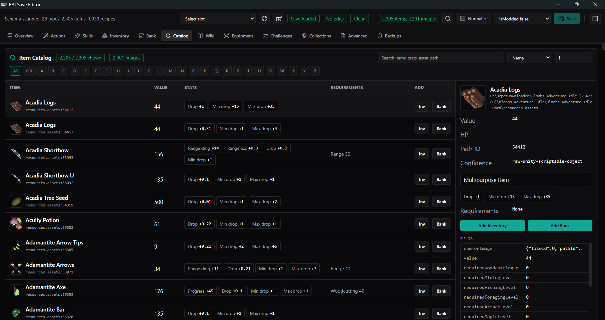 Catalog</td>
    <td align="center">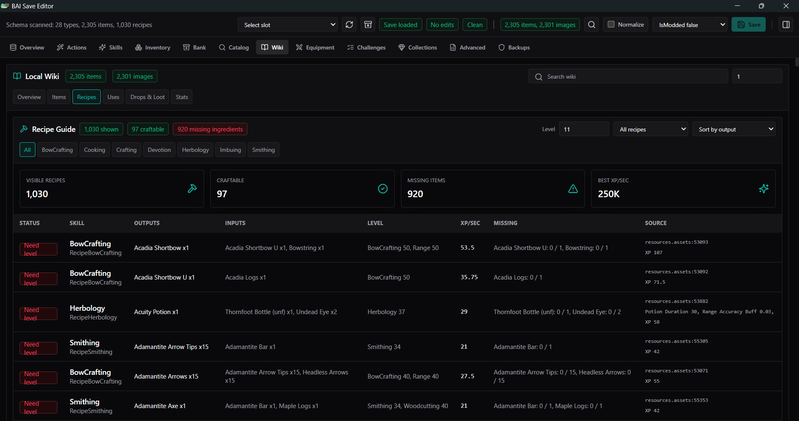 Wiki</td>
    <td align="center">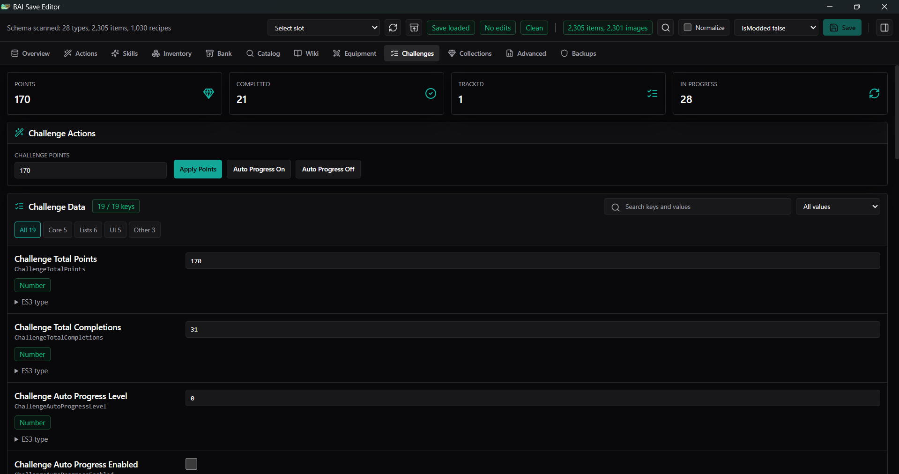 Challenges</td>
  </tr>
  <tr>
    <td align="center">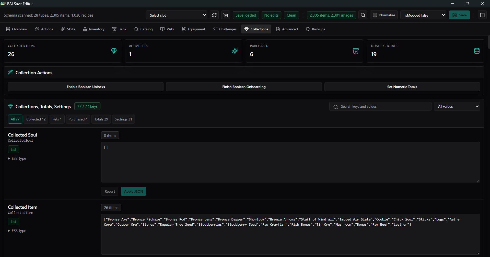 Collections</td>
    <td align="center">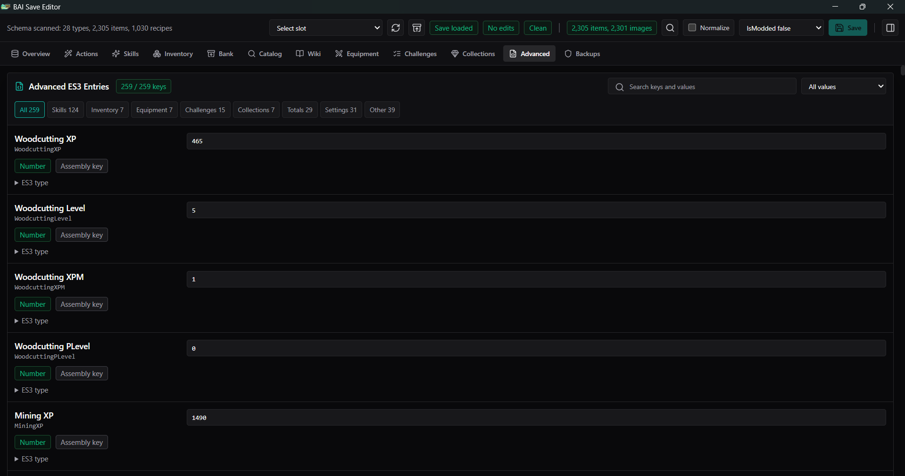 Advanced</td>
    <td align="center"></td>
  </tr>
</table>

## Download

1. Open the GitHub repository: [Gown-dono/BloobsAdventureIdleSaveEditor](https://github.com/Gown-dono/BloobsAdventureIdleSaveEditor).
2. Click **Code -> Download ZIP** or download the latest release ZIP if one is available.
3. Extract the ZIP somewhere convenient, such as your Desktop or Downloads folder.
4. Run `BAI Save Editor.exe`.

The app is unsigned, so Windows SmartScreen may show a warning. Choose **More info** and then **Run anyway**.

## What It Can Do

- Auto-detect the game install, save folder, save slots, and Unity game data.
- Edit `SaveFile.es3` and supported future save slots.
- Edit gold, quest points, skills, XP, multipliers, inventory, bank, equipment, challenges, collections, settings, and raw ES3 keys.
- Browse a local item catalog extracted from the installed game files, including item images where available.
- Add items to inventory or bank from the catalog.
- Edit saved item stats, requirements, quantities, values, and custom fields.
- Use the Wiki tab for local item, recipe, drop, stat, and crafting information extracted from the game itself.
- Preview unsaved changes and validation warnings before saving.
- Create automatic backups before writing saves and restore backups from the app.
- Keep `IsModded=false` by default, while still allowing users to preserve or force the flag if they choose.
- Auto-scan schema/catalog data on startup and refresh when the game updates.

**Startup note:** each launch currently runs a scan that can take a few minutes. This keeps the catalog, wiki, recipes, icons, and schema aligned with the installed game version after updates.

## Game Stat Patch

Some item stats are reset by the game on load from its built-in item database. The editor includes an optional **Game Stat Patch** that makes saved item stat edits survive game load for inventory, bank, and equipment items.

The patch:

- Backs up `Assembly-CSharp.dll` before changing it.
- Removes the game code that overwrites saved item stats with canonical item asset values.
- Can be checked, enabled, or restored from the Actions tab.

After a game update, run **Actions -> Game Stat Patch -> Check** and enable it again if needed.

## Safe Use

1. Close Bloobs Adventure Idle before saving or patching.
2. Open the editor and let it auto-scan.
3. Load your save slot.
4. Make edits.
5. Review unsaved changes and warnings.
6. Save. The editor creates a backup automatically.

If something goes wrong, use the Backups tab to restore an earlier save.

## Notes

- The local Wiki and item catalog come from your installed game files, so they are usually more current than old online guides.
- Patching game files is optional. Save editing works without it, but some non-HP item stat cheats may be reset by the unpatched game.
- Steam/game updates may replace patched files. Re-check patch status after updates.
- Bug reports and improvement ideas are welcome.
